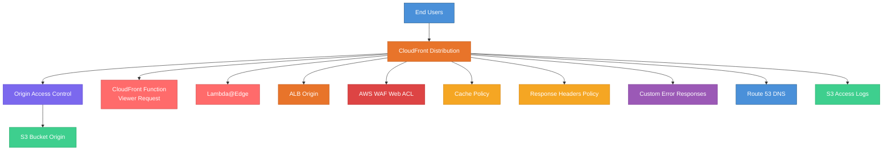

# terraform-aws-cloudfront-cdn

A production-ready Terraform module for deploying Amazon CloudFront CDN distributions with S3 and ALB origins, Origin Access Control, custom error responses, WAF integration, and Lambda@Edge support.

## Architecture



## Features

- CloudFront distribution with multi-origin support (S3 and ALB)
- Origin Access Control (OAC) for secure S3 bucket access
- Custom cache policy with configurable TTL and compression
- Response headers policy with security headers and CORS
- CloudFront Functions for lightweight viewer request handling
- Lambda@Edge function associations for advanced edge logic
- Custom error response configurations (SPA support)
- AWS WAF Web ACL integration for DDoS and bot protection
- Route 53 alias records for custom domain names
- Access logging to S3
- Geo restriction support

## Usage

### Basic

```hcl
module "cloudfront_cdn" {
  source = "github.com/kogunlowo123/terraform-aws-cloudfront-cdn"

  project_name = "my-website"
  environment  = "prod"

  s3_origin_bucket = {
    bucket_regional_domain_name = aws_s3_bucket.website.bucket_regional_domain_name
    bucket_id                   = aws_s3_bucket.website.id
  }
}
```

### Complete

See the [examples/complete](examples/complete/main.tf) directory for a full configuration example including custom domains, WAF, Lambda@Edge, and logging.

## Requirements

| Name      | Version   |
|-----------|-----------|
| terraform | >= 1.5.0  |
| aws       | >= 5.30.0 |

## Inputs

| Name | Description | Type | Default |
|------|-------------|------|---------|
| project_name | Name of the project | string | - |
| environment | Environment name | string | "prod" |
| domain_names | List of CNAMEs | list(string) | [] |
| acm_certificate_arn | ACM certificate ARN | string | null |
| s3_origin_bucket | S3 origin configuration | object | null |
| alb_origin | ALB origin configuration | object | null |
| waf_web_acl_id | WAF Web ACL ID | string | null |
| lambda_edge_functions | Lambda@Edge associations | list(object) | [] |
| custom_error_responses | Custom error responses | list(object) | 403/404 SPA defaults |

## Outputs

| Name | Description |
|------|-------------|
| distribution_id | CloudFront distribution ID |
| distribution_arn | CloudFront distribution ARN |
| distribution_domain_name | CloudFront domain name |
| oac_id | Origin Access Control ID |
| cache_policy_id | Cache policy ID |

## License

MIT Licensed. See [LICENSE](LICENSE) for details.
